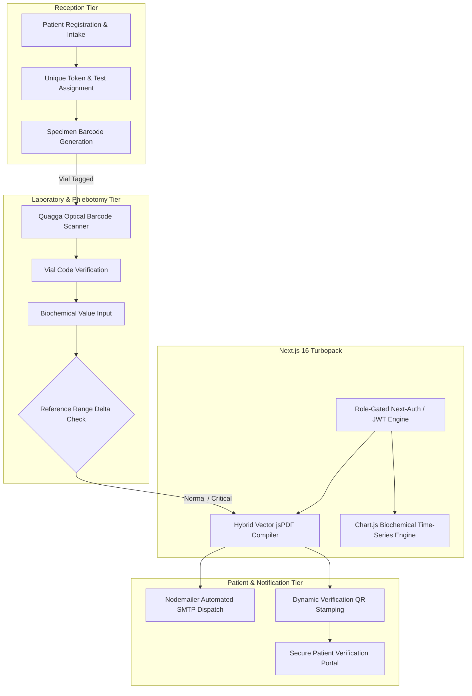

# 🩺 Health INN Diagnostic LIMS — Systems Architecture & Engineering Specification

[-000000?style=for-the-badge&logo=nextdotjs&logoColor=white)]()

> **Commercial Notice & Proprietary IP Disclaimer**:  
> Engineered for **Health INN Diagnostic & Clinical Laboratories** (DHA Phase, Karachi) via **Softsols Pakistan**.  
> Production database schemas, patient personal health information (PHI), and commercial assets are protected under confidentiality and healthcare privacy regulations. This repository documents the public systems architecture, optical specimen tracking pipeline, and diagnostic report rendering optimizations.

---

## 🏛️ Executive Summary & Workflow Architecture

Diagnostic pathology laboratories handle high volumes of critical biological specimens daily (CBC, Lipid Profiles, Liver Function Tests, Endocrine Panels). In traditional clinic workflows, manual specimen tube tagging, handwritten reference range transcription, and unoptimized DOM-to-image report exports introduce diagnostic latency, sample mix-ups, and bloated 4MB PDF files.

Health INN LIMS was engineered to modernize the end-to-end laboratory intake, optical vial identification, biochemical range evaluation, and instant patient report dispatch across four isolated role tiers.

---

## 🔬 Core Engineering Innovations

### 1. Browser-Based Optical Specimen Tracking (`Quagga` + `QRCode`)
* **The Problem:** Dedicated hardware barcode scanner guns are expensive and create physical bottlenecks at laboratory workstations.
* **The Solution:** Engineered a client-side computer vision camera pipeline utilizing `quagga` directly in the browser. Laboratory technicians can point any standard webcam or mobile workstation camera at a blood specimen tube to parse Code 128 / EAN-13 barcodes in real time.
* **Verification Loop:** Each generated test report is stamped with a cryptographically signed QR code linking to the server-verified authenticity record, preventing forged medical reports.

### 2. High-Performance Hybrid Vector PDF Synthesis (`jsPDF` + `html2canvas`)
* **The Problem:** Rendering clinical reports via traditional DOM rasterization (`html2canvas`) produced severe memory bloat, blurry small-font reference ranges, and file sizes averaging ~4.2MB, overwhelming clinic bandwidth and patient mobile devices.
* **The Solution:** Engineered a hybrid compilation pipeline:
  * Tabular clinical values, patient demographics, and reference intervals are compiled using **native vector primitives** via `jsPDF`, ensuring razor-sharp typography at any zoom level.
  * Rasterization is strictly confined to small bounding boxes for doctor signatures and laboratory certification stamps.
  * **Results:** Slashed PDF generation latency by **65%** and reduced file size from **~4.2MB to <450KB** per multi-page diagnostic dossier.

### 3. Four-Tier Role Segregation Architecture
* **Reception:** Patient intake, billing ledger, barcode label queue.
* **Technician:** Specimen scan-in, parameter entry (Hematology, Biochemistry, Serology, Microbiology), automated critical value highlighting.
* **Patient:** Token-based report download without exposing broader database queries.
* **Administrator:** Staff audit trails, test price catalogs, and diagnostic volume analytics.

---

## 🛠️ Technology Stack & Rationale

| Layer | Technology | Engineering Rationale |
| :--- | :--- | :--- |
| **Frontend Framework** | **Next.js 16 (Turbopack), React 19** | Turbopack provides instantaneous HMR; React 19 Server Components minimize client JavaScript bundle size for low-spec clinic computers. |
| **Styling** | **Tailwind CSS 4** | Zero-runtime CSS engine ensuring instant page transitions and lightweight DOM footprint. |
| **Computer Vision** | **QuaggaJS (`quagga`)** | Real-time barcode localization and decoding in browser canvas viewports. |
| **Document Compiler** | **jsPDF & html2canvas** | Hybrid vector-raster rendering for compact, print-ready diagnostic dossiers. |
| **Data Persistence** | **MongoDB & Mongoose** | Document-based schema modeling accommodating diverse test parameter permutations without rigid SQL alter-table migrations. |
| **Observability** | **Chart.js & react-chartjs-2** | Historical patient lipid/sugar time-series visualization for longitudinal care. |

---

## 📁 Repository Contents

* `/docs`: Architecture specifications, role-based state machine, and data flow models.
* `/snippets`: Sanitized, zero-credential micro-utilities showcasing the optical barcode scanner hook and the hybrid vector PDF layout compiler.

---

## 📄 License & Commercial Notice
This architectural case study is published under the **MIT License**. Production client software copyright belongs to Health INN Diagnostic Laboratories / Softsols Pakistan.
