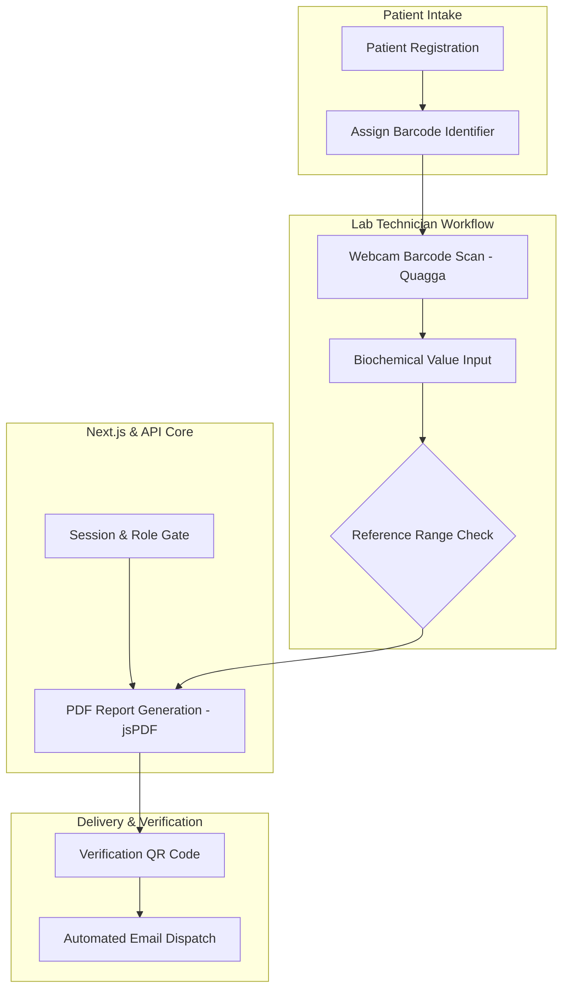

# Health INN Diagnostic LIMS — Architecture Case Study

Systems architecture and engineering case study for the Laboratory Information Management System (LIMS) deployed for **Health INN Diagnostic & Clinical Laboratories** (DHA, Karachi).

---

## Role & Scope

* **Role:** Sole Full-Stack Developer
* **Context:** Built under Softsols Pakistan. Engineered the production system from scratch.
* **Scope of Ownership:** Built the full application: patient registration, webcam barcode scanning for specimen vials, test result entry with automatic reference range flags, PDF report generation, and automated email delivery.

---

## System Flow

---

## Technical Highlights

* **Webcam Barcode Scanning:** Integrated client-side barcode scanning using `quagga`, enabling lab technicians to scan sample vial barcodes directly using regular webcams or mobile cameras without external handheld scanners.
* **Automated PDF Report Generation:** Built dynamic laboratory report generation using `jsPDF`, laying out test panels, patient details, doctor signatures, and verification QR codes.
* **Reference Range Flagging:** Configured automated checks comparing entered biochemical values against established reference ranges, highlighting abnormal values on the technician console and final report.
* **Role-Based Access:** Structured role-separated views for receptionists, lab technicians, and administrators to maintain sample tracking discipline.

---

## Tech Stack

* **Frontend & Backend:** Next.js 16 (Turbopack), React 19, TypeScript
* **Database:** MongoDB, Mongoose
* **Barcode & Document Utilities:** QuaggaJS, jsPDF, QRCode
* **Visualization & Styling:** Chart.js, Tailwind CSS

---

## Notice

Proprietary diagnostic schemas, patient personal health information (PHI), and clinical records are confidential under Health INN Laboratories and Softsols Pakistan. This repository documents system architecture and software workflows.
