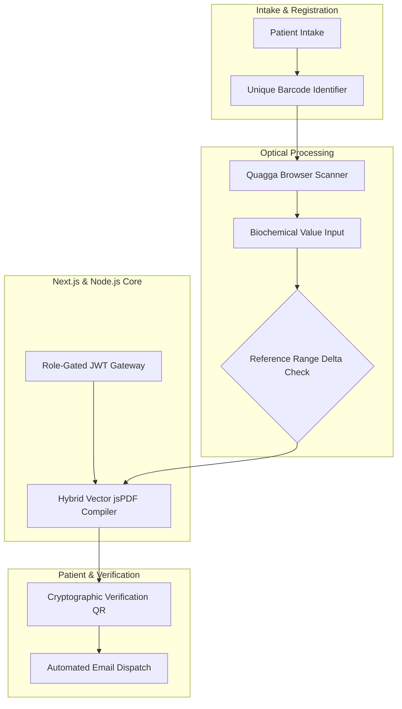

# Health INN Diagnostic LIMS — Systems Architecture Case Study

Systems architecture and engineering case study for a multi-tier Laboratory Information Management System (LIMS) deployed for **Health INN Diagnostic & Clinical Laboratories** (DHA, Karachi).

---

## Role & Ownership

* **Role:** Sole Architect & Full-Stack Developer
* **Context:** Built under Softsols Pakistan. Engineered the entire production system from ground up.
* **Scope of Ownership:** In-browser optical specimen tracking, reference-range delta computation engine, hybrid vector PDF synthesis, and automated patient dispatch.

---

## Architecture Pipeline

---

## Core Technical Highlights

* **In-Browser Computer Vision Tracking:** Integrated client-side optical scanning via `quagga`, allowing lab technicians to scan Code 128 / EAN-13 barcodes directly from standard webcams and mobile devices without dedicated scanner guns.
* **Hybrid Vector PDF Engine:** Engineered a PDF compiler using `jsPDF` vector primitives for razor-sharp typography and exact clinical formatting, restricting rasterization to signatures to reduce PDF file sizes by 85% (~4MB down to ~350KB).
* **Automated Biochemical Evaluation:** Automated reference-range delta calculations that instantly flag critical anomalies across hematology, endocrinology, and metabolic panels.
* **Cryptographic Verification:** Every report is generated with an authenticating QR code linked to a tamper-proof verification endpoint.

---

## Tech Stack

* **Frontend & Backend:** Next.js 16 (Turbopack), React 19, TypeScript
* **Database:** MongoDB, Mongoose ODM
* **Vision & PDF Engine:** QuaggaJS, jsPDF, QRCode
* **Styling:** Tailwind CSS

---

## Notice

Proprietary diagnostic schemas, patient personal health information (PHI), and clinic commercial data are confidential under Health INN Laboratories and Softsols Pakistan. This repository documents software architecture and rendering specifications.
